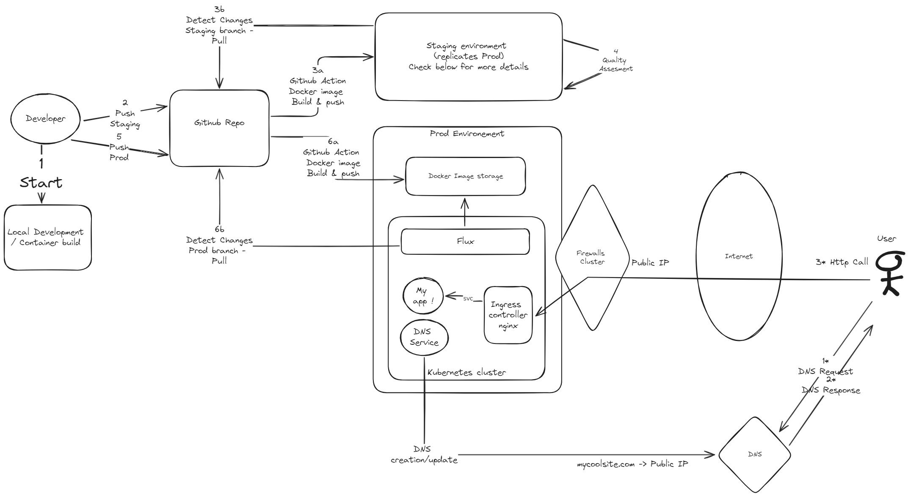

# Converter API

Hello Platomics Team,

This is my version of the small converter application asked in the coding challenge.

You will discover what I prepared. I hope you will have as much fun exploring it as I had creating it.

## Application

- The application runs on a docker with a simple flask/waitress server (Python)
  - The Idea here is to keep it as simple and light as possible
  - The image is ~70MB - reference image is a python alpine.
- You can use the docker compose to test it locally

      docker compose up -d

- The docker includes health check on the /health
  - Some sanity check are applied when triggering the /health to ensure the application works as intended end-to-end
  - The /health is used to perform a healthprobe for the docker compose.
- Accordigng to the specifications the API include this endpoint

      /convert/<value>/<input-format>/<output-format> GET

---

- With the arguments:
  
      <value>: Any alphanumeric value, but has to be in a format specified by <input-format>
      <input-format> and <output-format>:
        - dec: Specifies a decimal (base-10) format
        - bin: Specifies a binary (base-2) format
        - hex: Specifies a hexadecimal (base-16) format

## Production Infrastructure Archi

### Description

**You can try the application [HERE](https://converterapi.lactogen.net/)**

Here is a possible implementation in production:

- Let's host my application on a Kubernetes
  - App redundancy can be asssured by relevant healthcheck and a Kubernetes cluster using multiple physical servers the replicat count could not necessarly be set to more than 1.
- Build a CI with Gitub Actions
- Build a CD using Flux
- Ingress controller is an nginx
  - TLS terminaison endpoint
  - Can be used with a certbot to renew all the certificates
- For the public DNS I did not precise, it could be hosted on Cloudflare, Azure..
- 2 Environments, they take as a reference two different branches for Prod and Staging. We could add a third environment but as a matter of simplicity, we will talk only about one staging here.

### Kubernetes

- I uploaded the manifest used to make it run on my kubernetes.
- This is a Kubernetes instance running on Azure (AKS)
  - It has automatic certificate renewal and automatic DNS updating
  - The ingress/egress flows are passing through an external firewall
- Note that the CI/CD is not implemented

- You can check the manifest files used in:

      ./kubernetes-nanifests

### Scheme

## Author

YL

## Licence

WTFPL
